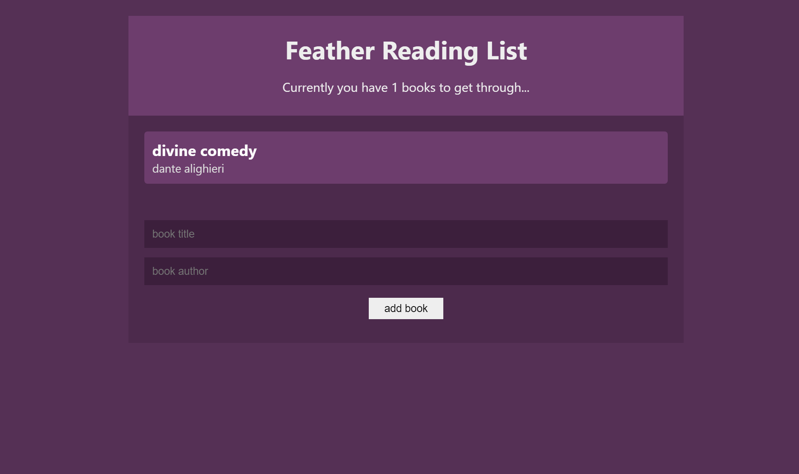

# My Reading List

 React newest features can be used to build Stateful React applications without the use of Redux. (*Context and Reducer*)

From [The Net Ninja
](https://www.youtube.com/channel/UCW5YeuERMmlnqo4oq8vwUpg) tutorials.

## Screenshot



### Prerequisites

What things you need to install.

```
NodeJs
```

### Setup

#### Step 00 - install
```
npm i
```
#### Step 01 - start
```
npm start
```

## Build Project

```
npm build
```

## Built With

* [React](https://reactjs.org/) - The web framework used

## Versioning

We use [SemVer](http://semver.org/) for versioning. For the versions available, see the [tags on this repository](https://github.com/your/project/tags). 

## Authors

* **Jafet** - *Initial work* - [F34th3R](https://github.com/F34th3R)


## License

This project is licensed under the MIT License - see the [LICENSE.md](LICENSE.md) file for details

